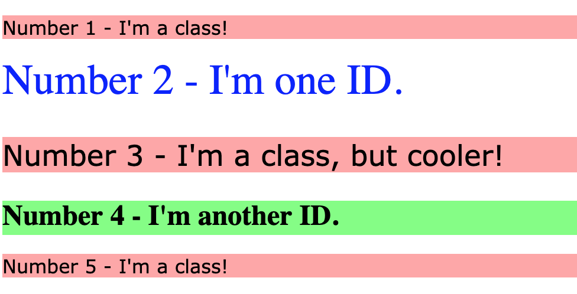

I practiced adding class and ID attributes to HTML elements and using their selectors, which is essential for styling.

In the provided HTML file, I assigned class or ID attributes based on the outcome image and applied styles in the CSS file using the correct selector syntax. I focused on identifying similarly styled elements (classes), unique elements (IDs), and those with slight variations (multiple classes).

For colors, I used non-keyword values (RGB, HEX, or HSL). The properties to add to each element are: 
- **All odd-numbered elements**: 
  - Light red/pink background
  - Fonts: Verdana, DejaVu Sans, sans-serif fallback
  
- **Second element**: 
  - Blue text
  - Font size: 36px
  
- **Third element**: 
  - Inherits styles from odd-numbered elements
  - Font size: 24px
  
- **Fourth element**: 
  - Light green background
  - Font size: 24px
  - Bold text

## Desired Outcome

### Self Check
- Do the odd numbered `p` elements share a class?
- Do the even numbered `div` elements have unique IDs?
- Does the Number 3 element have multiple classes?
