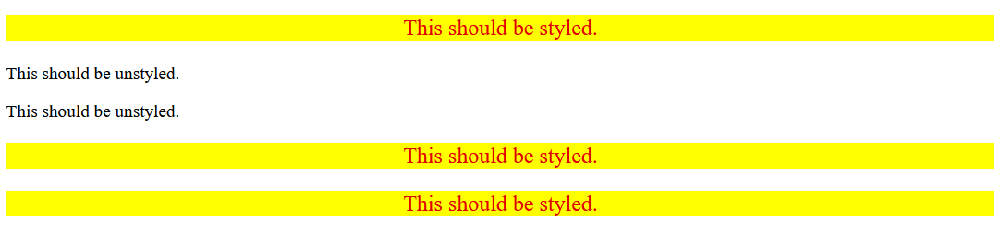

Understanding how combinators work is easier through practice.

In this exercise, I applied styles to elements that are descendants of another element, ensuring non-descendant elements remained unstyled.

I used type and class selectors to target the styles. Specifically, I styled only the `p` elements that are descendants of the `div` element:

- **Styles applied**: 
  - Yellow background
  - Red text
  - Font size: 20px
  - Center aligned

## Desired Outcome

### Self Check
- Do the elements that contain the text "This should be styled" have the correct styles applied?
- Do the elements that contain the text "This should be unstyled" have no styles applied?
